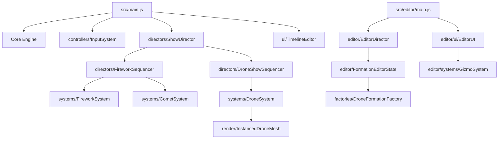

# STRUCTURE-dev.md

## 1. Logical Modules

### Core Engine
- **`src/core/SceneManager.js`**: Setup Three.js scene, lights, environment and post-processing dependencies.
- **`src/core/CameraManager.js`**: Setup camera and resize events.
- **`src/core/Renderer.js`**: Setup WebGL renderer.
- **`src/core/Clock.js`**: Manage animation delta time.
- **`src/core/PerformanceMonitor.js`**: Manage stats and performance metrics.
- **`src/core/PostProcessingPipeline.js`**: Setup bloom and post-processing effects.

### Entity Models
- **`src/entities/ShellEntity.js`**: Base shell model containing physical state (position, velocity, age, etc).
- **`src/entities/CometEntity.js`**: Base comet model containing physical state.
- **`src/entities/DroneEntity.js`**: OOP representation of a drone (largely bypassed during high-performance playback).
- **`src/entities/DroneMotionProfile.js`**: Physics parameters for steering-behavior drones.

### Factories & Generators
- **`src/factories/ShellPresetFactory.js`**: Returns specific preset parameters for different firework types.
- **`src/factories/BurstShapeGenerator.js`**: Calculates directional vectors for different explosion shapes (sphere, heart, willow, ring).
- **`src/factories/BurstEffectProcessor.js`**: Computes velocity/color transformations for effects (strobe, crackle, wave).
- **`src/factories/DroneFormationFactory.js`**: Computes 3D coordinates for shapes (grid, circle, sphere, cube, text, etc.).
- **`src/factories/DronePropertyFactory.js`**: Assigns LED colors to drones based on logical rules.

### Systems (ECS)
- **`src/systems/FireworkSystem.js`**: Core system running each frame to spawn, move, and burst shells.
- **`src/systems/CometSystem.js`**: System running each frame to spawn, move and fade comets.
- **`src/systems/TrailSystem.js`**: Manages particle trails behind shells and comets.
- **`src/systems/SmokeSystem.js`**: Generates smoke at explosion locations.
- **`src/systems/SkyLightReactionSystem.js`**: Simulates global sky lighting reacting to explosions.
- **`src/systems/AudioSystem.js`**: Plays launch/burst spatial audio.
- **`src/systems/MovementSystem.js`**: Manages camera movement logic over time.
- **`src/systems/DroneSystem.js`**: Handles global performance zone offsets and the `InstancedDroneMesh` rendering buffer.

### Orchestration & Controllers
- **`src/controllers/InputSystem.js`**: Handles user input (keyboard, mouse) and delegates to MovementSystem/Directors.
- **`src/directors/FireworkSequencer.js`**: Translates high-level sequence scripts into timed launch commands.
- **`src/directors/DroneShowSequencer.js`**: High-performance interpolation engine syncing pre-calculated drone JSON steps to the global timeline.
- **`src/directors/ShowDirector.js`**: Master clock for the Firework Show. Loads JSON scripts, orchestrates `FireworkSequencer` and `DroneShowSequencer`.

### UI & Editor (New)
- **`src/ui/TimelineEditor.js`**: Manages the drag-and-drop timeline interface for sequencing fireworks, audio, and drone shows.
- **`src/ui/PropertyInspector.js`**: Inspects and modifies the properties of timeline events.
- **`src/editor/main.js`**: Entry point for the standalone Drone Formation Editor application.
- **`src/editor/FormationEditorState.js`**: Manages the state of the drone editor (selections, steps, playback history).
- **`src/editor/EditorDirector.js`**: High-performance InstancedMesh rendering loop and math effects for the drone editor.
- **`src/editor/ui/EditorUI.js`**: DOM UI logic for the drone editor tools.
- **`src/editor/systems/GizmoSystem.js`**: Provides 3D translation/rotation/scaling gizmos for editing drone positions.

### Config
- **`src/config/launchZone.js`**: Defines the physical bounds for launching fireworks.
- **`src/config/droneZone.js`**: Defines the local spatial coordinate system and global offset for Drone Shows.
- **`src/config/rendering.js`**: Toggles graphics settings like Bloom.
- **`src/config/sequences/`**: Contains predefined show scripts (`demoShow`, `droneDemo`).

## 2. Entry Points
- **`src/main.js`**: Firework Show application entry point. Initializes engine core, systems, directors, and UI.
- **`src/editor/main.js`**: Drone Editor application entry point.

## 3. Relationship Graph

## 4. Execution Flows
- **Initialization**: `main.js` -> Setup Core -> Init Systems -> Init Directors -> Wait for Input.
- **Timeline Playback**: `ShowDirector.update()` -> Syncs `FireworkSequencer` and `DroneShowSequencer` based on `elapsedTime`.
- **Drone Interpolation**: `DroneShowSequencer` calculates `msTime` -> finds current & next step from JSON -> Lerps coordinates & applies procedural maths (wave, pulse) -> writes to `InstancedDroneMesh`.
- **Drone Editing**: `editor/main.js` -> UI modifies `FormationEditorState` -> `EditorDirector` continuously updates `InstancedMesh`.

## 5. Cross-Module Dependencies
- **TrailSystem**: Heavily depended upon by both `FireworkSystem` and `CometSystem`.
- **ShowDirector**: God-object for time coordination, intimately bound to both Sequencers and the TimelineEditor UI.

## 6. Problems & Anti-patterns
- **Event Bus vs Direct Calls**: Mixed paradigms. Some logic uses `CustomEvent`, others use direct method calls.
- **InputSystem Coupling**: Tightly coupled to `MovementSystem` and `FireworkSystem`.
- **State Duplication**: `DroneShowSequencer` mimics the logic of `EditorDirector`. An abstraction could unify the interpolation engine used in both playback and editing modes.
