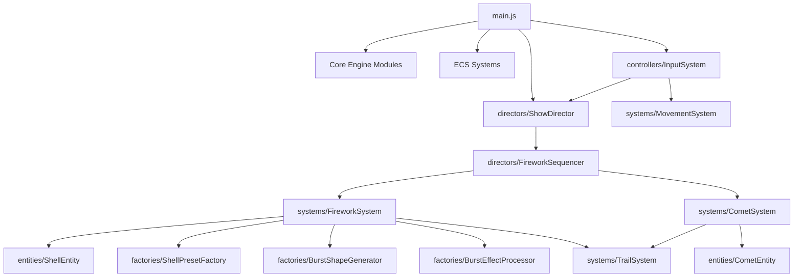

# STRUCTURE.md

## 1. Logical Modules

### Core Engine
- **`src/core/SceneManager.js`**: Setup Three.js scene, lights, environment and post-processing dependencies.
- **`src/core/CameraManager.js`**: Setup camera and resize events.
- **`src/core/Renderer.js`**: Setup WebGL renderer.
- **`src/core/Clock.js`**: Manage animation delta time.
- **`src/core/PerformanceMonitor.js`**: Manage stats and performance.
- **`src/core/PostProcessingPipeline.js`**: Setup bloom and post-processing effects.

### Entity Models
- **`src/entities/ShellEntity.js`**: Base shell model containing physical state (position, velocity, age, etc).
- **`src/entities/CometEntity.js`**: Base comet model containing physical state.

### Factories & Generators
- **`src/factories/ShellPresetFactory.js`**: Returns specific preset parameters for different firework types.
- **`src/factories/BurstShapeGenerator.js`**: Calculates directional vectors for different explosion shapes (sphere, heart, willow, ring).
- **`src/factories/BurstEffectProcessor.js`**: Computes velocity/color transformations for effects (strobe, crackle, wave).

### Systems (ECS)
- **`src/systems/FireworkSystem.js`**: Core system running each frame to spawn, move, and burst shells.
- **`src/systems/CometSystem.js`**: System running each frame to spawn, move and fade comets.
- **`src/systems/TrailSystem.js`**: Manages particle trails behind shells and comets.
- **`src/systems/SmokeSystem.js`**: Generates smoke at explosion locations.
- **`src/systems/SkyLightReactionSystem.js`**: Simulates global sky lighting reacting to explosions.
- **`src/systems/AudioSystem.js`**: Plays launch/burst spatial audio.
- **`src/systems/MovementSystem.js`**: Manages camera/drone movement logic over time.

### Orchestration & Controllers
- **`src/controllers/InputSystem.js`**: Handles user input (keyboard, mouse) and delegates to MovementSystem/Directors.
- **`src/directors/FireworkSequencer.js`**: Translates high-level sequence scripts into timed launch commands.
- **`src/directors/ShowDirector.js`**: Controls the overall timeline, playing/pausing scripts.

### Config
- **`src/config/launchZone.js`**: Defines the physical bounds for launching fireworks.
- **`src/config/rendering.js`**: Toggles graphics settings like Bloom.
- **`src/config/sequences/`**: Contains predefined show scripts (`demoShow`, `grandFinale`).

## 2. Entry Points
- **`src/main.js`**: Application entry point. Initializes engine core, systems, directors, and the main requestAnimationFrame loop.

## 3. Relationship Graph

## 4. Execution Flows
- **Initialization**: `main.js` -> Setup Core -> Init Systems -> Init Directors -> Wait for Input.
- **Auto/Scripted Launch**: `ShowDirector` -> Reads Script -> `FireworkSequencer` -> calls `FireworkSystem.launchRandom()` or `CometSystem.launchRandom()` at precise timestamps.
- **Manual Launch**: `InputSystem` handles mouse click -> triggers `FireworkSystem.launchRandom()`.
- **Game Loop**: `main.js` animate() -> calls `update(deltaTime)` on all active systems (Movement, Firework, Trail, Comet, etc.) -> calls `Renderer.render()`.
- **Firework Lifecycle**: `FireworkSystem` updates shell position -> if apex reached -> `createBurst()` via Factories -> switch to burst state -> fade out -> finish.

## 5. Cross-Module Dependencies
- **TrailSystem**: Heavily depended upon by both `FireworkSystem` and `CometSystem`.
- **AudioSystem & CameraManager**: Shared globally but decoupled via event listeners (for audio) and direct references (for camera).

## 6. Problems & Anti-patterns
- **Event Bus vs Direct Calls**: Some logic uses `CustomEvent` (`firework:launch`) for Audio/SkyLight, while others (`TrailSystem`) use direct method calls. A unified message bus or strict ECS approach could improve consistency.
- **InputSystem Coupling**: Still tightly coupled to `MovementSystem` and `FireworkSystem`, which makes it a god-object for input.
