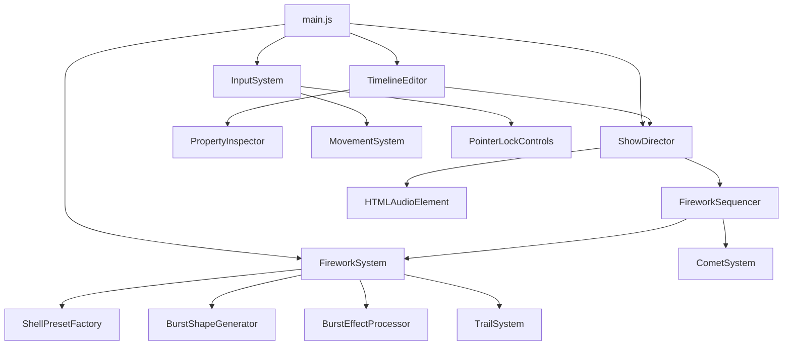

# STRUCTURE.md

## 1. Logical Modules

### Core Infrastructure
- **`src/main.js`**: Application entry point that initializes all systems, ECS components, and configures the `animate` loop.
- **`src/core/Clock.js`**: Manages global delta time and frame tracking.
- **`src/core/Renderer.js`**: Handles Three.js WebGLRenderer instantiation, resize events, and tone mapping configurations.
- **`src/core/CameraManager.js`**: Controls the PerspectiveCamera and viewport resizing.
- **`src/core/SceneManager.js`**: Manages the main Three.js scene, environment lighting, and rendering bounds.
- **`src/core/PerformanceMonitor.js`**: Utility to track frame times and performance statistics.
- **`src/core/PostProcessingPipeline.js`**: Instantiates and configures bloom, tone mapping, and composite passes.

### Performance Sequence & Orchestration
- **`src/directors/ShowDirector.js`**: The overarching time manager for the fireworks script, handling `play`, `pause`, `stop`, `seek`, and synchronization of HTML5 `Audio` tracks alongside visual events.
  - `loadScript(scriptConfig)`: Prepares the sequence events and preloads audio context maps.
  - `update(deltaTime)`: Triggers sequencer events when timeline crosses their timestamp, handles continuous audio syncing.
- **`src/directors/FireworkSequencer.js`**: Executes specialized visual choreographies (patterns, sweeps, finales) based on configuration data.
  - `playPattern()`: Dispatches standard firework patterns.
  - `playCometSequence()`: Dispatches non-bursting comet flow patterns.

### Simulation Systems (ECS-like Systems)
- **`src/systems/FireworkSystem.js`**: Manages the lifecycle of standard explosive `ShellEntity` objects.
  - `update(deltaTime)`: Advances physics and triggers bursts.
  - `burstAll()`: Force-bursts all currently launching shells immediately (used for editor pausing).
- **`src/systems/CometSystem.js`**: Manages the lifecycle of `CometEntity` objects which fly and fade without a terminal burst effect.
- **`src/systems/TrailSystem.js`**: Generates and manages the particle tails behind ascending shells and comets.
- **`src/systems/SmokeSystem.js`**: Renders volumetric smoke sprites left behind by bursts and trails.
- **`src/systems/SkyLightReactionSystem.js`**: Analyzes burst intensities to create dynamic background ambient light flashes.
- **`src/systems/AudioSystem.js`**: Spatial and environmental audio engine for explosion and lift sound effects using the Web `AudioContext` API.
- **`src/systems/MovementSystem.js`**: Controls First-Person-like 3D camera navigation based on WASD input keys.

### Entity Models
- **`src/entities/ShellEntity.js`**: State representation of an explosive projectile (position, velocity, age, color, pattern config).
- **`src/entities/CometEntity.js`**: State representation of a fading, non-bursting projectile.

### Factories & Generators
- **`src/factories/ShellPresetFactory.js`**: Generates pre-configured firework payloads (e.g., Peony, Chrysanthemum, Ring, Willow) mapping string keys to visual parameters.
- **`src/factories/BurstShapeGenerator.js`**: Computes spatial algorithms for 3D particle distribution (Sphere, Ring, Heart, Smiley).
- **`src/factories/BurstEffectProcessor.js`**: Modifies particle behaviors post-burst to generate effects like strobe, crackle, willow, or fish.

### User Interface & Tooling
- **`src/controllers/InputSystem.js`**: Captures native browser events (Keyboard, Mouse) and translates them into semantic commands for `MovementSystem` and `ShowDirector`. Manages PointerLock API interactions.
- **`src/ui/TimelineEditor.js`**: CapCut-style horizontal UI sequence block editor allowing drag-and-drop of scripts and MP3 files.
  - `addSequence()`: Adds a visual block to the timeline.
  - `saveSequence()`: Exports visual tracks directly to the user's browser via Blob URL and Clipboard API.
- **`src/ui/PropertyInspector.js`**: Right-side UI panel dynamically rendering editable configuration forms for the currently selected timeline block.

### Configuration
- **`src/config/rendering.js`**: Static JSON-like configuration for graphics settings, post-processing intensity, and performance limits.
- **`src/config/sequences/index.js`**: Exposes default performance configurations.
- **`src/config/sequences/demoShow.js`**: JSON-style array representing a sequenced show.

## 2. Entry Points
1. **`src/main.js`**: Browser Webpack/Vite entry point.
2. **`TimelineEditor.js` (DOM Events)**: Handles mouse clicks on the timeline interface to trigger script modifications and `ShowDirector` timeline manipulation.
3. **`InputSystem.js` (DOM Events)**: Primary interceptor for user interaction (Pointer Lock, Escape key).

## 3. Relationship Graph

## 4. Execution Flows

### Timeline Audio Sync Flow
1. User drops `.mp3` into `TimelineEditor`.
2. `TimelineEditor` reads file duration, inserts `audio` sequence object, triggers `ShowDirector.loadScript()`.
3. `ShowDirector` creates new `HTMLAudioElement` mapping in `this.audioPlayers`.
4. User clicks Play/Spacebar. `ShowDirector.update()` loop activates.
5. In `update(deltaTime)`, `ShowDirector` calculates if `elapsedTime` falls within the sequence block. If yes, it syncs `audio.currentTime = elapsedTime - seq.time` and calls `audio.play()`.

### Simulation Flow (Physics & Effects)
1. `ShowDirector` triggers `FireworkSequencer.playPattern()`.
2. `FireworkSequencer` delegates payload creation to `FireworkSystem.launch()`.
3. `FireworkSystem` instantiates `ShellEntity` and links `TrailSystem`.
4. During `main.js -> FireworkSystem.update()`, shell altitude reaches peak or lifetime expires.
5. `FireworkSystem` queries `ShellPresetFactory` for effect configs, generates particles via `BurstShapeGenerator`, and applies post-burst modifiers via `BurstEffectProcessor`.
6. Particle states are propagated to `SmokeSystem` and `SkyLightReactionSystem`.

## 5. Cross-Module Dependencies
- **Global Clearing Protocol**: The event `firework:clear` is dispatched by `ShowDirector`/`TimelineEditor` during seeking/stopping, which requires tight coupling with `FireworkSystem`, `SmokeSystem`, and `TrailSystem` to globally reset visual states.
- **`ShowDirector` & Context Mapping**: `ShowDirector` acts as the single source of truth for time, forcing all systems to react passively to its `elapsedTime` rather than managing their own simulation bounds.

## 6. Problems & Anti-patterns
- **Audio Responsibility Split**: `AudioSystem.js` relies heavily on Web `AudioContext` for programmatic 3D sounds (bursts, lift), whereas `ShowDirector.js` internally manages `HTMLAudioElement` maps for music. This splits audio responsibility across two totally different APIs and layers.
- **Input Control Tight Coupling**: `InputSystem.js` creates and manages Three.js `PointerLockControls` directly while also listening for `Escape` to toggle `TimelineEditor`. This binds raw HTML DOM interaction directly to the WebGL Camera logic.
- **Event Bus Overuse**: Usage of generic `window.addEventListener('firework:launch')` in `AudioSystem` introduces hidden runtime dependencies that are difficult to trace statically in the module tree.
